# E-Commerce Platform - Architecture & Workflow Diagrams

This document contains comprehensive architecture and workflow diagrams for the Saree Elegance e-commerce platform.

---

## 1. System Architecture Overview

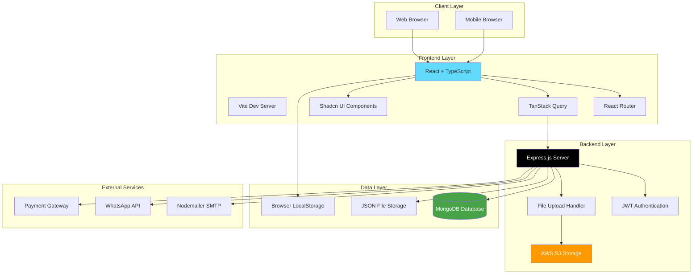

---

## 2. Frontend Component Architecture

```mermaid
graph TB
    subgraph "App.tsx - Root Component"
        QueryClient[QueryClientProvider]
        Router[BrowserRouter]
        Layout[Layout Component]
    end
    
    subgraph "Layout Component"
        Header[Header/Navbar]
        Footer[Footer]
        WhatsApp[WhatsApp Widget]
    end
    
    subgraph "Public Pages"
        Home[Home Page]
        Products[Products/Shop]
        ProductDetail[Product Detail]
        Blog[Blog]
        PageView[Static Pages]
        Login[Login]
        Register[Register]
    end
    
    subgraph "Authenticated Pages"
        Cart[Cart]
        Checkout[Checkout]
        Account[Account]
        Orders[Orders]
        Wishlist[Wishlist]
        TrackOrder[Track Order]
    end
    
    subgraph "Admin Pages"
        Admin[Admin Dashboard]
        AdminProducts[Product Management]
        AdminOrders[Order Management]
        AdminSettings[Settings]
        AdminBlogs[Blog Management]
        AdminGallery[Gallery Management]
    end
    
    subgraph "Shared Components"
        ProductCard[ProductCard]
        HeroCarousel[HeroCarousel]
        AboutUs[AboutUs]
        ContactUs[ContactUs]
        PrivacyPolicy[PrivacyPolicy]
        TermsConditions[TermsConditions]
        ReturnsPolicy[ReturnsPolicy]
    end
    
    QueryClient --> Router
    Router --> Layout
    Layout --> Header
    Layout --> Footer
    Layout --> WhatsApp
    
    Router --> Home
    Router --> Products
    Router --> ProductDetail
    Router --> Blog
    Router --> PageView
    Router --> Login
    Router --> Register
    
    Router --> Cart
    Router --> Checkout
    Router --> Account
    Router --> Orders
    Router --> Wishlist
    Router --> TrackOrder
    
    Router --> Admin
    Router --> AdminProducts
    Router --> AdminOrders
    Router --> AdminSettings
    Router --> AdminBlogs
    Router --> AdminGallery
    
    Products --> ProductCard
    Home --> HeroCarousel
    PageView --> AboutUs
    PageView --> ContactUs
    PageView --> PrivacyPolicy
    PageView --> TermsConditions
    PageView --> ReturnsPolicy
    
    style Admin fill:#ff6b6b
    style Authenticated fill:#4ecdc4
    style Public fill:#95e1d3
```

---

## 3. Authentication & Authorization Flow

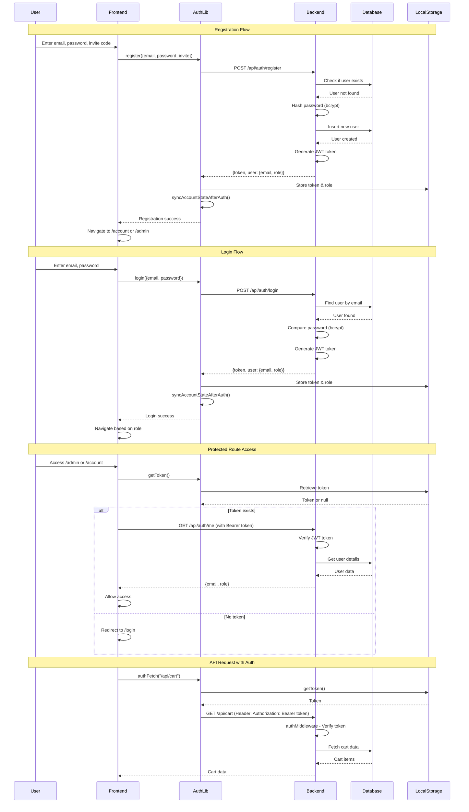

---

## 4. Shopping Cart Flow

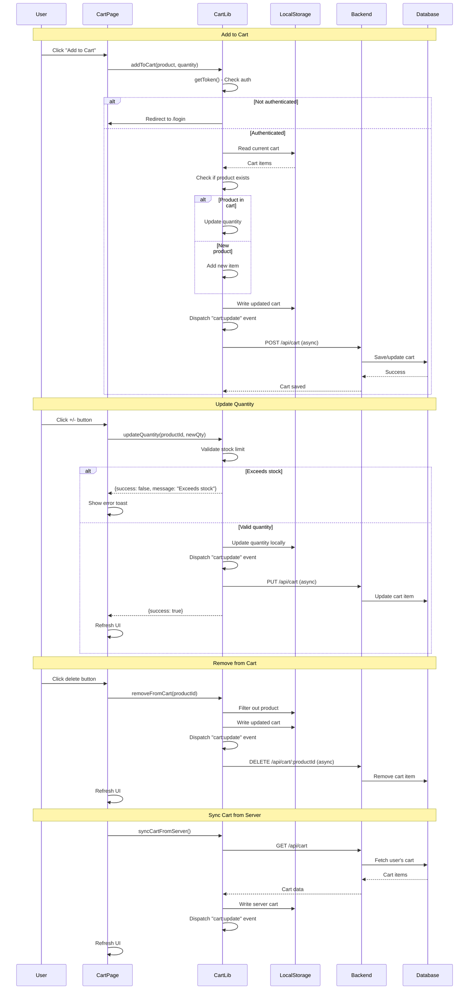

---

## 5. Order Processing Flow

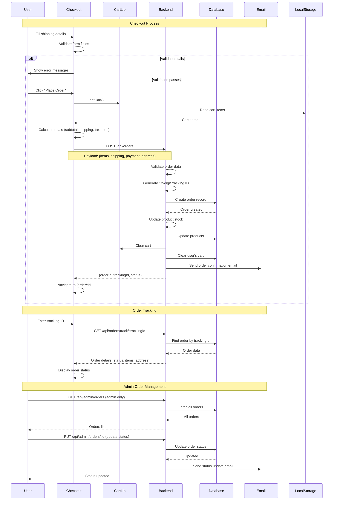

---

## 6. Admin Workflow

```mermaid
graph TB
    subgraph "Admin Access"
        Login[Admin Login]
        Verify[Verify Admin Role]
        Dashboard[Admin Dashboard]
    end
    
    subgraph "Product Management"
        AddProduct[Add New Product]
        EditProduct[Edit Product]
        DeleteProduct[Delete Product]
        UploadImage[Upload Product Images]
        ManageStock[Manage Stock]
    end
    
    subgraph "Order Management"
        ViewOrders[View All Orders]
        UpdateStatus[Update Order Status]
        TrackOrder[Track Orders]
        GenerateReport[Generate Reports]
    end
    
    subgraph "Content Management"
        ManageBlogs[Manage Blog Posts]
        ManageGallery[Manage Gallery]
        ManageBanners[Manage Banners]
        ManageCarousel[Manage Carousel]
        ManagePages[Manage Static Pages]
    end
    
    subgraph "Settings Management"
        SiteSettings[Site Settings]
        ShippingCharges[Shipping Charges]
        SocialLinks[Social Media Links]
        WhatsAppConfig[WhatsApp Configuration]
    end
    
    Login --> Verify
    Verify -->|Admin Role| Dashboard
    Verify -->|Not Admin| Login
    
    Dashboard --> AddProduct
    Dashboard --> EditProduct
    Dashboard --> DeleteProduct
    Dashboard --> UploadImage
    Dashboard --> ManageStock
    
    Dashboard --> ViewOrders
    Dashboard --> UpdateStatus
    Dashboard --> TrackOrder
    Dashboard --> GenerateReport
    
    Dashboard --> ManageBlogs
    Dashboard --> ManageGallery
    Dashboard --> ManageBanners
    Dashboard --> ManageCarousel
    Dashboard --> ManagePages
    
    Dashboard --> SiteSettings
    Dashboard --> ShippingCharges
    Dashboard --> SocialLinks
    Dashboard --> WhatsAppConfig
    
    style Admin fill:#ff6b6b
    style Product fill:#4ecdc4
    style Order fill:#95e1d3
    style Content fill:#f38181
    style Settings fill:#a8e6cf
```

---

## 7. Data Flow Architecture

```mermaid
graph LR
    subgraph "Frontend State Management"
        ReactState[React State]
        TanStackQuery[TanStack Query Cache]
        LocalStorage[Browser LocalStorage]
        Context[React Context]
    end
    
    subgraph "API Layer"
        AuthFetch[authFetch Helper]
        FetchAPI[Standard Fetch]
        APIBase[API Base URL Config]
    end
    
    subgraph "Backend API Routes"
        AuthRoute[/api/auth]
        ProductsRoute[/api/products]
        CartRoute[/api/cart]
        OrdersRoute[/api/orders]
        AdminRoute[/api/admin/*]
        SettingsRoute[/api/settings]
    end
    
    subgraph "Data Storage"
        MongoDB[(MongoDB)]
        JSONFiles[JSON Files]
        FileSystem[File System]
        S3Bucket[AWS S3]
    end
    
    ReactState --> TanStackQuery
    TanStackQuery --> AuthFetch
    TanStackQuery --> FetchAPI
    AuthFetch --> APIBase
    FetchAPI --> APIBase
    
    APIBase --> AuthRoute
    APIBase --> ProductsRoute
    APIBase --> CartRoute
    APIBase --> OrdersRoute
    APIBase --> AdminRoute
    APIBase --> SettingsRoute
    
    AuthRoute --> MongoDB
    AuthRoute --> JSONFiles
    ProductsRoute --> MongoDB
    ProductsRoute --> JSONFiles
    CartRoute --> MongoDB
    CartRoute --> JSONFiles
    OrdersRoute --> MongoDB
    OrdersRoute --> JSONFiles
    AdminRoute --> MongoDB
    AdminRoute --> JSONFiles
    SettingsRoute --> JSONFiles
    
    ProductsRoute --> FileSystem
    ProductsRoute --> S3Bucket
    AdminRoute --> FileSystem
    AdminRoute --> S3Bucket
    
    LocalStorage --> ReactState
    Context --> ReactState
    
    style MongoDB fill:#47a248,color:#fff
    style S3Bucket fill:#ff9900,color:#fff
    style TanStackQuery fill:#ff4154,color:#fff
```

---

## 8. API Structure & Endpoints

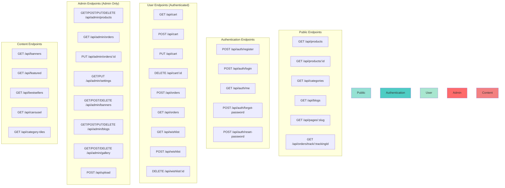

---

## 9. User Journey Flow

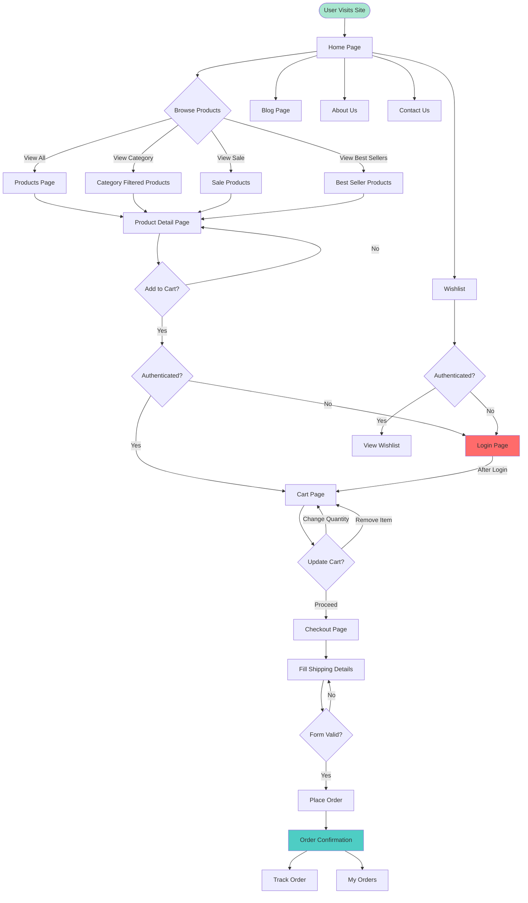

---

## 10. File Upload & Storage Flow

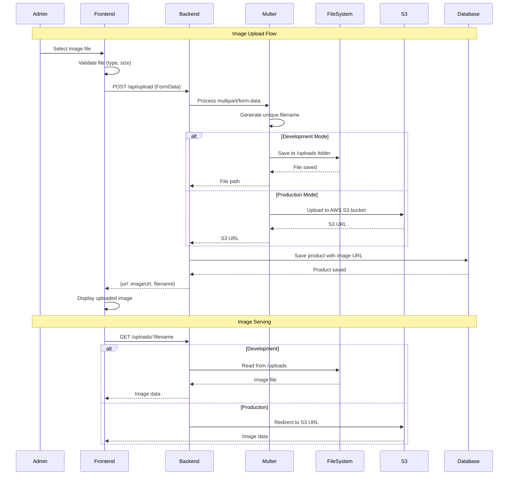

---

## 11. Database Schema (Conceptual)

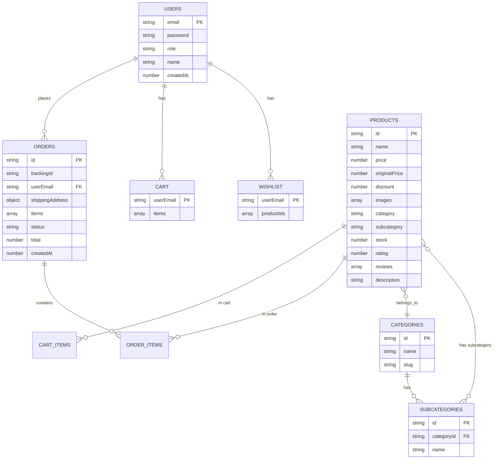

---

## 12. Deployment Architecture

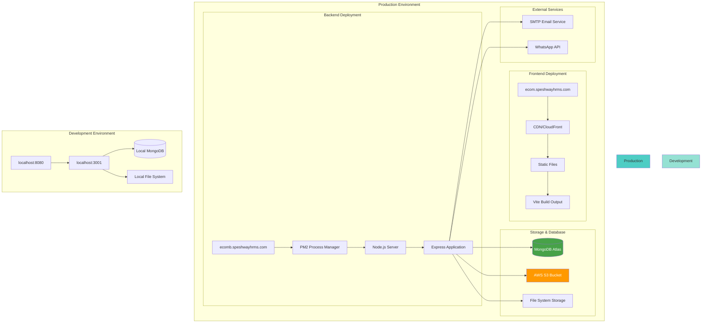

---

## 13. Security Architecture

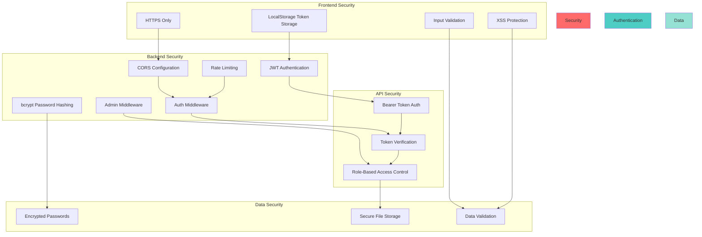

---

## 14. State Management Flow

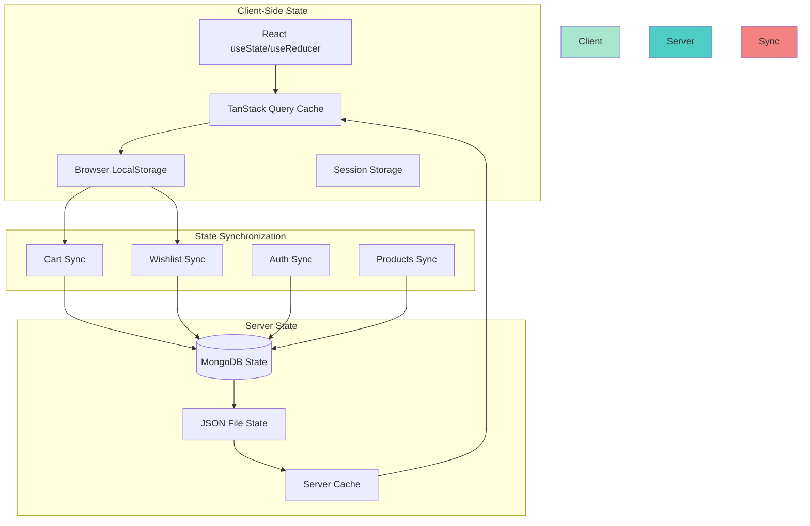

---

## Summary

This e-commerce platform follows a modern **MERN stack** architecture with the following key characteristics:

1. **Frontend**: React + TypeScript with Vite, TanStack Query for data fetching, and Shadcn UI components
2. **Backend**: Express.js with JWT authentication, supporting both MongoDB and JSON file storage
3. **Storage**: AWS S3 for production file storage, local file system for development
4. **Authentication**: JWT-based authentication with role-based access control (admin/user)
5. **State Management**: Combination of React state, TanStack Query cache, and localStorage
6. **API Design**: RESTful API with clear separation between public, authenticated, and admin endpoints
7. **Security**: HTTPS, CORS, JWT tokens, password hashing, input validation
8. **Deployment**: Separate frontend and backend domains with proper CORS configuration

The architecture supports both development (local) and production (AWS) environments with seamless transitions between them.

